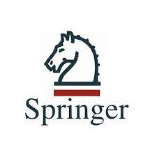

## Biography
I am an incoming Ph.D. student in Computer Science at [School of Computing](https://www.comp.nus.edu.sg/), [National University of Singapore](https://nus.edu.sg/), fully supported by President's Graduate Fellowship. Recently, I received my Master degree in Computer Technology at [Tsinghua Shenzhen International Graduate School](https://www.sigs.tsinghua.edu.cn/en/), [Tsinghua University](https://www.tsinghua.edu.cn/en/), supervised by Prof. [Chun Yuan](https://www.sigs.tsinghua.edu.cn/yc2_en/main.htm). My research interests are in Computer Vision and Computer Graphics. Before that, I received my Bachelor degree in Software Engineering from [School of Computer Science & Technology](https://cs.bit.edu.cn), [Beijing Institute of Technology](https://english.bit.edu.cn/). 

Click [here](../files/Zenghao_Chai_CV.pdf) to find my up-to-date CV.

## Education

  <ul>
  <li>2023.08 - 2027.07 (Expected)</li>
  - Ph.D. Candidate in Computer Science at <a href="https://www.comp.nus.edu.sg/">School of Computing</a>, <a href="https://nus.edu.sg/">National University of Singapore</a>. 
  - Research Topics: Computer Vision, Computer Graphics, Multimedia, Machine Learning.
  </ul>
  

  <ul>
  <li>2020.09 - 2023.07</li>
  - Master in Computer Technology at <a href="https://www.sigs.tsinghua.edu.cn/en/">Tsinghua Shenzhen International Graduate School</a>, <a href="https://www.tsinghua.edu.cn/en/">Tsinghua University</a>, supervised by <i>Prof</i>. <a href="https://www.sigs.tsinghua.edu.cn/yc2_en/main.htm">Chun Yuan</a>. 
  - GPA: <b>3.74</b>/4.00 
  - Research Topics: Computer Vision, Computer Graphics, Machine Learning.
  </ul>
  

  <ul>
  <li>2016.09 - 2020.07</li>
  - Bachelor in Software Engineering at <a href="https://cs.bit.edu.cn/">School of Computer Science & Technology</a>, <a href="https://english.bit.edu.cn/">Beijing Institute of Technology</a>.  
  - GPA: <b>90.97</b>/100 (Top 1%)
  </ul>
  

## Work Experience

  <ul>
  <li>2022.05 - 2023.03</li>
  - Research Intern at <a href="https://www.msra.cn/">Microsoft Research Asia</a>, Machine Learning Group, Beijing, China.  
  - Supervised by <a href="https://www.microsoft.com/en-us/research/people/xuta/">Xu Tan</a> and <a href="https://www.microsoft.com/en-us/research/people/tianyuhe/">Tianyu He</a>. 
  - Research Topics: Talking Face Generation, 3D Face Reconstruction.
  </ul>
  

  <ul>
  <li>2021.03 - 2022.05</li>
  - Research Intern at <a href="https://ai.tencent.com/ailab/en/index/">Tencent AI Lab</a>, Digital Human Team, Shenzhen, China.  
  - Supervised by <a href="http://linchaobao.github.io/">Linchao Bao</a> and Haoxian Zhang. 
  - Research Topics: 3D Face Reconstruction, 3D Face Modeling & Evaluation.
  </ul>
  

  <ul>
  <li>2019.12 - 2020.05</li>
  - Software QA Intern at <a href="https://www.megvii.com/">MEGVII</a>, Beijing, China. 
  </ul>
  

## Publications and Preprints
\'\*\' indicates equal contributions.

* **<u>Towards Effective Collaborative Learning in Long-Tailed Recognition</u>** 
Zhengzhuo Xu\*, **<u>Zenghao Chai</u>**\*, Chengyin Xu, Chun Yuan, Haiqin Yang 
arXiv, 2023. 
<a href="https://arxiv.org/abs/2305.03378" class="click_button">arXiv</a>

* **<u>HiFace: High-Fidelity 3D Face Reconstruction by Learning Static and Dynamic Details</u>** 
**<u>Zenghao Chai</u>**, Tianke Zhang, Tianyu He, Xu Tan, Tadas Baltru&scaron;aitis, HsiangTao Wu, Runnan Li, Sheng Zhao, Chun Yuan, Jiang Bian 
arXiv, 2023. 
<a href="https://arxiv.org/abs/2303.11225" class="click_button">arXiv</a>
<a href="https://project-hiface.github.io/" class="click_button">Page</a>

* **<u>Searching Transferable Mixed-Precision Quantization Policy through Large Margin Regularization</u>** 
Chen Tang, Kai Ouyang, **<u>Zenghao Chai</u>**, Yunpeng Bai, Zhi Wang 
arXiv, 2023. 
<a href="https://arxiv.org/abs/2302.06845" class="click_button">arXiv</a>

* **<u>ERA-Solver: Error-Robust Adams Solver for Fast Sampling of Diffusion Probabilistic Models</u>** 
Shengmeng Li, Luping Liu, **<u>Zenghao Chai</u>**, Runnan Li, Xu Tan 
arXiv, 2023. 
<a href="https://arxiv.org/abs/2301.12935" class="click_button">arXiv</a>

* **<u>Learning Imbalanced Data with Vision Transformers</u>** 
Zhengzhuo Xu, Ruikang Liu, Shuo Yang, **<u>Zenghao Chai</u>**, Chun Yuan 
IEEE/CVF Conference on Computer Vision and Pattern Recognition (**CVPR**), 2023. 
<a href="https://arxiv.org/abs/2212.02015" class="click_button">arXiv</a>
<a href="https://github.com/XuZhengzhuo/LiVT" class="click_button">Code</a> 
<a href="https://openaccess.thecvf.com/content/CVPR2023/papers/Xu_Learning_Imbalanced_Data_With_Vision_Transformers_CVPR_2023_paper.pdf" class="click_button">PDF</a>
<a href="https://openaccess.thecvf.com/content/CVPR2023/supplemental/Xu_Learning_Imbalanced_Data_CVPR_2023_supplemental.pdf" class="click_button">Supplementary</a>
<a href="https://cvpr2023.thecvf.com/media/PosterPDFs/CVPR%202023/22904.png?t=1683529433.022824" class="click_button">Poster</a>

* **<u>HHF: Hashing-guided Hinge Function for Deep Hashing Retrieval</u>** 
Chengyin Xu\*, **<u>Zenghao Chai</u>**\*, Zhengzhuo Xu\*, Hongjia Li, Qiruyi Zuo, Lingyu Yang, Chun Yuan. 
IEEE Transactions on Multimedia (**TMM**), 2022. 
<a href="https://arxiv.org/abs/2112.02225" class="click_button">arXiv</a>
<a href="https://github.com/JerryXu0129/HHF" class="click_button">Code</a>
<a href="https://ieeexplore.ieee.org/document/9953581" class="click_button">IEEE</a>

* **<u>REALY: Rethinking the Evaluation of 3D Face Reconstruction</u>** 
**<u>Zenghao Chai</u>**\*, Haoxian Zhang\*, Jing Ren, Di Kang, Zhengzhuo Xu, Xuefei Zhe, Chun Yuan, Linchao Bao. 
European Conference on Computer Vision (**ECCV**), 2022. 
<a href="https://arxiv.org/abs/2203.09729" class="click_button">arXiv</a>
<a href="https://www.realy3dface.com/" class="click_button">Page</a>
<a href="https://github.com/czh-98/REALY" class="click_button">Code</a>
<a href="https://www.ecva.net/papers/eccv_2022/papers_ECCV/papers/136680072.pdf" class="click_button">PDF</a>
<a href="https://www.ecva.net/papers/eccv_2022/papers_ECCV/papers/136680072-supp.pdf" class="click_button">Supplementary</a>
<a href="https://drive.google.com/file/d/1jSeM5daC68_JMinZdLjwoOdtvAQlITnH/view?usp=sharing" class="click_button">Poster</a>

* **<u>Semantic-Sparse Colorization Network for Deep Exemplar-based Colorization</u> 
Yunpeng Bai, Chao Dong, **<u>Zenghao Chai</u>**, Andong Wang, Zhengzhuo Xu, Chun Yuan. 
European Conference on Computer Vision (**ECCV**), 2022. 
<a href="https://arxiv.org/abs/2112.01335" class="click_button">arXiv</a>
<a href="https://github.com/bbaaii/SSC-Net" class="click_button">Code</a>
<a href="https://www.ecva.net/papers/eccv_2022/papers_ECCV/papers/136660495.pdf" class="click_button">PDF</a>
<a href="https://www.ecva.net/papers/eccv_2022/papers_ECCV/papers/136660495-supp.pdf" class="click_button">Supplementary</a>
<a href="https://drive.google.com/file/d/1c-blvMpsmB0897gJP_XYznOeQC9Juxs1/view?usp=sharing" class="click_button">Poster</a>

* **<u>HyP$^2$ Loss: Beyond Hypersphere Metric Space for Multi-label Image Retrieval</u>**
Chengyin Xu\*, **<u>Zenghao Chai</u>**\*, Zhengzhuo Xu, Chun Yuan, Yanbo Fan, Jue Wang.  ACM International Conference on Multimedia (**ACM MM**), 2022. 
<a href="https://arxiv.org/abs/2208.06866" class="click_button">arXiv</a>
<a href="https://github.com/JerryXu0129/HyP2-Loss/" class="click_button">Code</a>
<a href="https://dl.acm.org/doi/pdf/10.1145/3503161.3548032" class="click_button">PDF</a>
<a href="https://dl.acm.org/doi/pdf/10.1145/3503161.3548032" class="click_button">Supplementary</a>

* **<u>CMS-LSTM: Context Embedding and Multi-Scale Spatiotemporal Expression LSTM for Predictive Learning</u>** 
**<u>Zenghao Chai</u>**, Zhengzhuo Xu, Yunpeng Bai, Zhihui Lin, Chun Yuan. 
IEEE International Conference on Multimedia and Expo (**ICME**), 2022. 
<a href="https://arxiv.org/abs/2102.03586" class="click_button">arXiv</a>
<a href="https://github.com/czh-98/CMS-LSTM" class="click_button">Code</a>
<a href="https://ieeexplore.ieee.org/document/9859659" class="click_button">IEEE</a>

* **<u>MoDeRNN: Towards Fine-grained Motion Details for Spatiotemporal Predictive Learning</u>** 
**<u>Zenghao Chai</u>**, Zhengzhuo Xu, Chun Yuan. 
IEEE International Conference on Acoustics, Speech and Signal Processing (**ICASSP**), 2022. 
<a href="https://arxiv.org/abs/2110.12978" class="click_button">arXiv</a>
<a href="https://github.com/czh-98/MoDeRNN" class="click_button">Code</a>
<a href="https://ieeexplore.ieee.org/document/9747035" class="click_button">IEEE</a>

* **<u>Towards Calibrated Model for Long-Tailed Visual Recognition from Prior Perspective</u>** 
Zhengzhuo Xu\*, **<u>Zenghao Chai</u>**\*, Chun Yuan. 
Neural Information Processing Systems (**NeurIPS**), 2021. 
<a href="https://arxiv.org/abs/2111.03874" class="click_button">arXiv</a>
<a href="https://github.com/XuZhengzhuo/Prior-LT" class="click_button">Code</a>
<a href="https://openreview.net/forum?id=vqzAfN-BoA_" class="click_button">OpenReview</a>
<a href="https://proceedings.neurips.cc/paper_files/paper/2021/file/39ae2ed11b14a4ccb41d35e9d1ba5d11-Paper.pdf" class="click_button">PDF</a>
<a href="https://proceedings.neurips.cc/paper_files/paper/2021/file/39ae2ed11b14a4ccb41d35e9d1ba5d11-Supplemental.pdf" class="click_button">Supplementary</a>

* **<u>Research on Learning Mechanism Designing for Equilibrated Bipolar Spiking Neural Networks</u>** 
Xu Yang, Jiajun Lin, Wenhao Zheng, Jinfeng Zhao, Mengyao Ji, Yunlin Lei, **<u>Zenghao Chai</u>**. 
**Artificial Intelligence Review**, 2020. 
<a href="https://link.springer.com/article/10.1007/s10462-020-09818-5" class="click_button">Springer</a>

* **<u>Correlation Analysis-Based Neural Network Self-Organizing Genetic Evolutionary Algorithm</u>** 
**<u>Zenghao Chai</u>**, Xu Yang, Zhilin Liu, Yunlin Lei, Wenhao Zheng, Mengyao Ji, Jinfeng Zhao. 
**IEEE Access**, 2019. 
<a href="https://ieeexplore.ieee.org/abstract/document/8843933" class="click_button">IEEE</a>

* **<u>Constructing an Associative Memory System Using Spiking Neural Network</u>** 
Hu He, Yingjie Shang, Xu Yang, Yingze Di, Jiajun Lin, Yimeng Zhu, Wenhao Zheng, Jinfeng Zhao, Mengyao Ji, Liya Dong, Ning Deng, Yunlin Lei, **<u>Zenghao Chai</u>**. 
**Frontiers in neuroscience**, 2019. 
<a href="https://www.frontiersin.org/articles/10.3389/fnins.2019.00650/full" class="click_button">Frontiers</a>

* **<u>Amazons Evaluation Optimization Strategy Based on PSO Algorithm</u>** 
**<u>Zenghao Chai</u>**, Zhiyuan Fang, Jie Zhu. 
Chinese Control And Decision Conference (**CCDC**), 2019. 
<a href="https://ieeexplore.ieee.org/abstract/document/8832447" class="click_button">IEEE</a>

## Patents

+ Chengyin Xu, **Zenghao Chai**, Zhengzhuo Xu, Yanbo Fan.
A Retrieval Method and Apparatus, Device, and Storage Medium. Invention patent. Published Application Number: CN115146143A. 2022.

* Chun Yuan, **Zenghao Chai**, Zhengzhuo Xu. A Lightweight Fine-grained Spatiotemporal Predictive Method and System. Invention patent. Published Application Number: CN114445463A. 2022.

* Chongyang Shi, Zhaohe Liao, **Zenghao Chai**. A Move Generation Method for *Game of the Amazons* Based on Deep Convolutional Neural Network. Invention patent. Authorization Announcement Number: CN111330255B. 2020. 

## Awards and Honors
* **First Prize** in Internship Award of Tsinghua University (**TOP 1%**), 2023.05.
* Award of **Excellence** in "Star of Tomorrow" Internship Program of Microsoft Research Asia (**TOP 5%**), 2023.03
* Ministry of Education National Scholarship for Postgraduates (**TOP 1%**), 2022.11.
* Ping An AI BANK Fellowship (**TOP 5%**), 2021.09.
* Beijing Outstanding Graduate (**TOP 5%**), 2020.07.
* Beijing Institute of Technology Outstanding Graduate (**TOP 5%**), 2020.07.
* Teli Xu Fellowship (**TOP 0.1%, best honor for undergraduates**), 2020.06.
* Beijing Merit Student (**TOP 1%**), 2020.05.
<!-- * Second Prize of Beijing Institute of Technology Competition Scholarship, 2019.09 -->
<!-- * First Prize Scholarship of Beijing Institute of Technology (TOP 5%), 2020.09 -->
<!-- * First Prize Scholarship of Beijing Institute of Technology (TOP 5%), 2020.03 -->
<!-- * Ministry of Education National Scholarship (**TOP 1%**), 2019.10. -->
* Beijing Institute of Technology Competition Scholarship (**TOP 5%, 2 times**), 2019-2020.
* **Gold Medal** of ICGA Computer Olympiad 2019, 2019.08.
<!-- * First Prize Scholarship of Beijing Institute of Technology (TOP 5%), 2019.09 -->
* **Meritorious Winner** of MCM/ICM Contest in Modeling, 2019.04.
* Ministry of Industry and Information Technology Innovation Scholarship (**TOP 1%**), 2019.04.
<!-- * First Prize Scholarship of Beijing Institute of Technology (TOP 5%), 2019.03 -->
* **Gold Medal** of International Genetically Engineered Machine competition (IGEM), 2018.12.
* Ministry of Education National Scholarship for Undergraduates (**TOP 1%, 2 times**), 2018-2019.
<!-- * First Prize Scholarship of Beijing Institute of Technology (TOP 5%), 2018.09 -->
* **Second Prize** of University Computer Games Championship & National Computer Games Tournament, 2018.08.
<!-- * First Prize Scholarship of Beijing Institute of Technology (TOP 5%), 2018.03 -->
* **Third Prize** of Beijing Physics Competition, 2017.11.
* **First Prize** of China Mathematics Competition, 2017.10.
* **First Prize** of Beijing Mathematics Competition, 2017.10.
* JJWorld Fellowship (**TOP 5%**), 2017.09.
* First Prize Scholarship of Beijing Institute of Technology (**TOP 5%, 6 times**), 2017-2020.
<!-- * Second Prize Scholarship of Beijing Institute of Technology (Top 15%), 2017.03 -->

